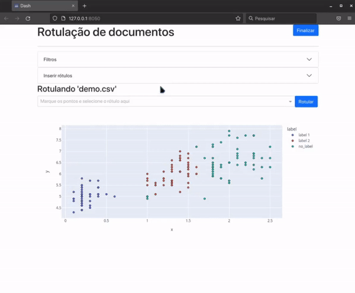
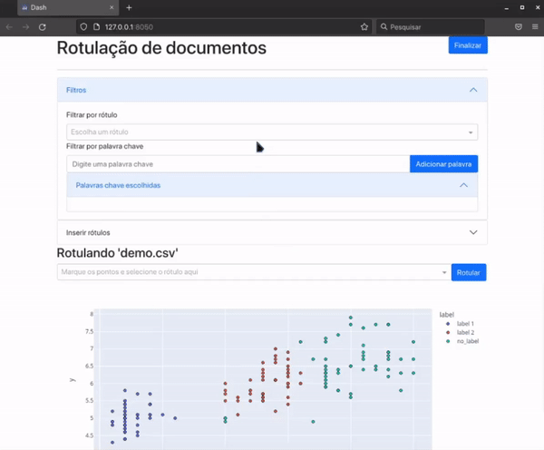

# Dataset labeler

[Dash](https://dash.plotly.com/) app help labeling datasets based on
multidimensional projection of the dataset.

# Install

Create and activate the virtual env:

    $ python -m venv venv
    $ . venv/bin/activate

Install required libs:

    $ pip install -r requirements.txt

# Input file

`.csv` file with columns:

- `x`: x coordinate of each point;
- `y`: y coordinate of each point;
- `text`: corresponding document text;
- `label` (optional): corresponding label of each document.

IMG

# Interactive labeling

Set your dataset file path in variable `db_name`.

Starting the app:

    $ python app.py

## Creating your labels

## Visualizing each document content

Mouse hover or click:

## Labeling documents

## Filtering by label

## Filtering by keywords

## Saving the 

# TODO

- Load dataset file from command line;
- Hide console output in debug mode;
- Translate interface.

Propose your pull request.
